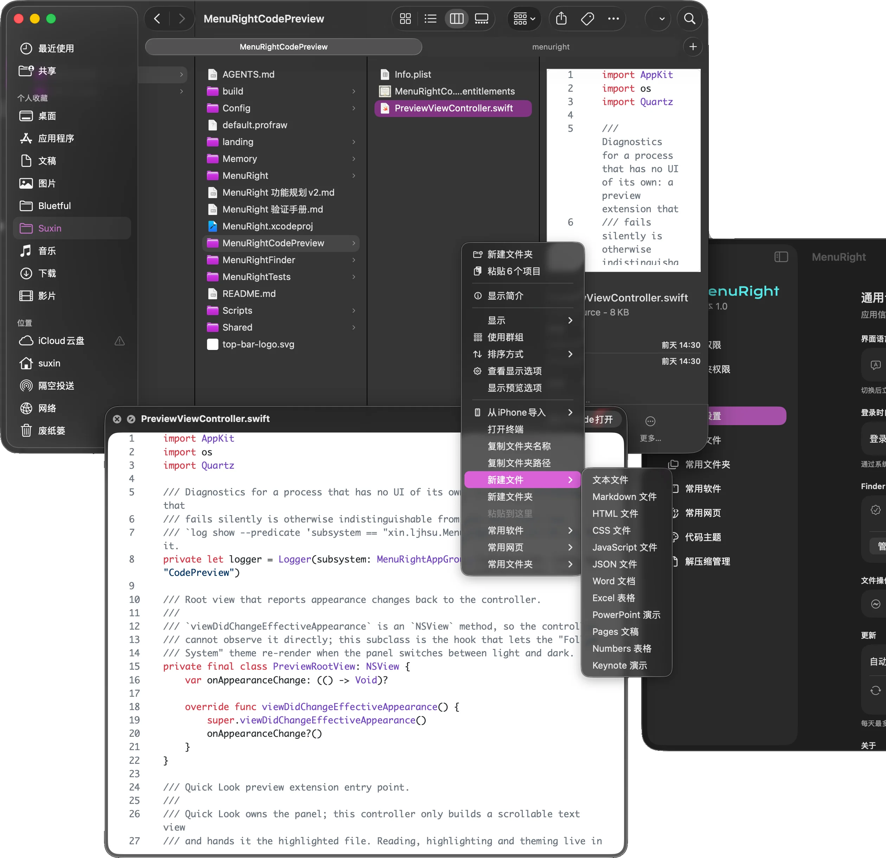
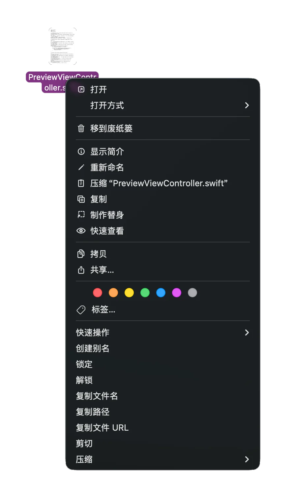
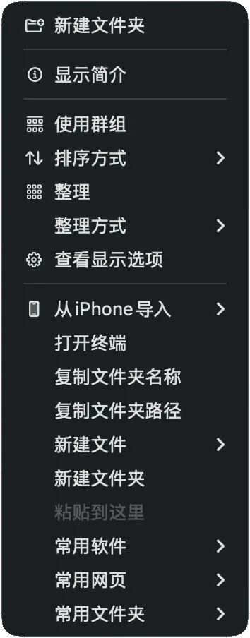
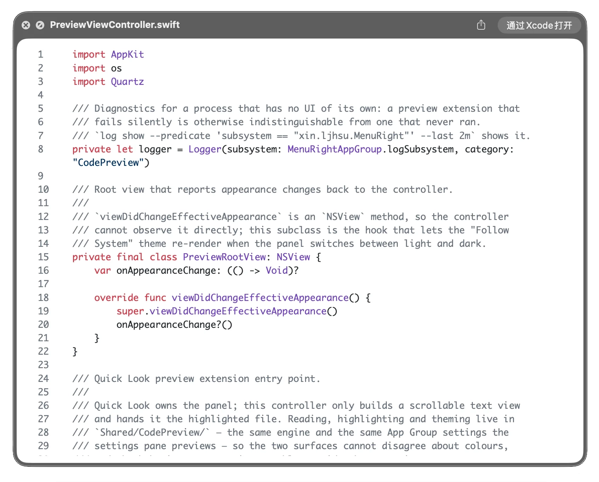
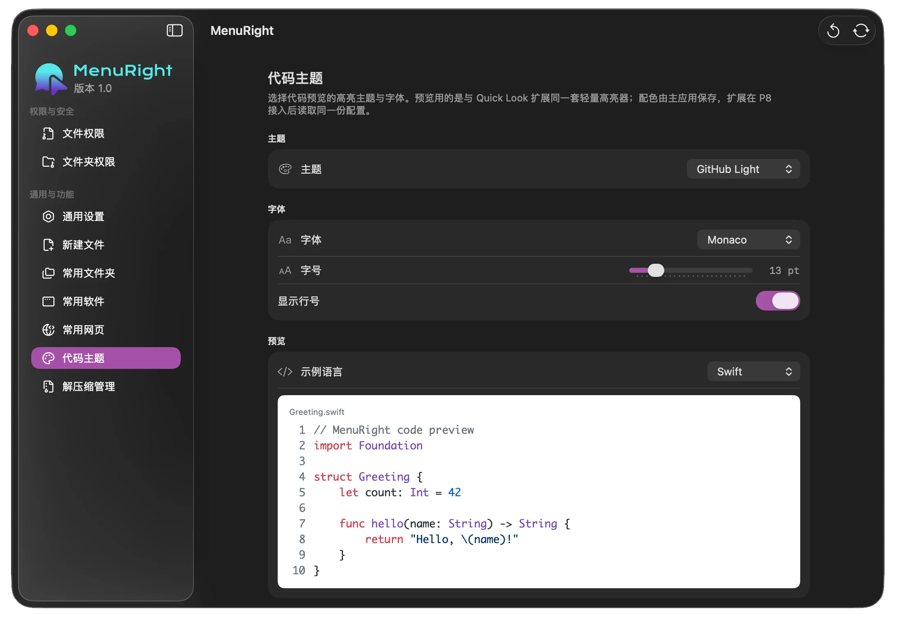
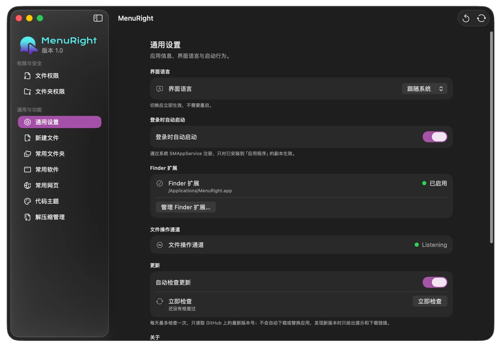
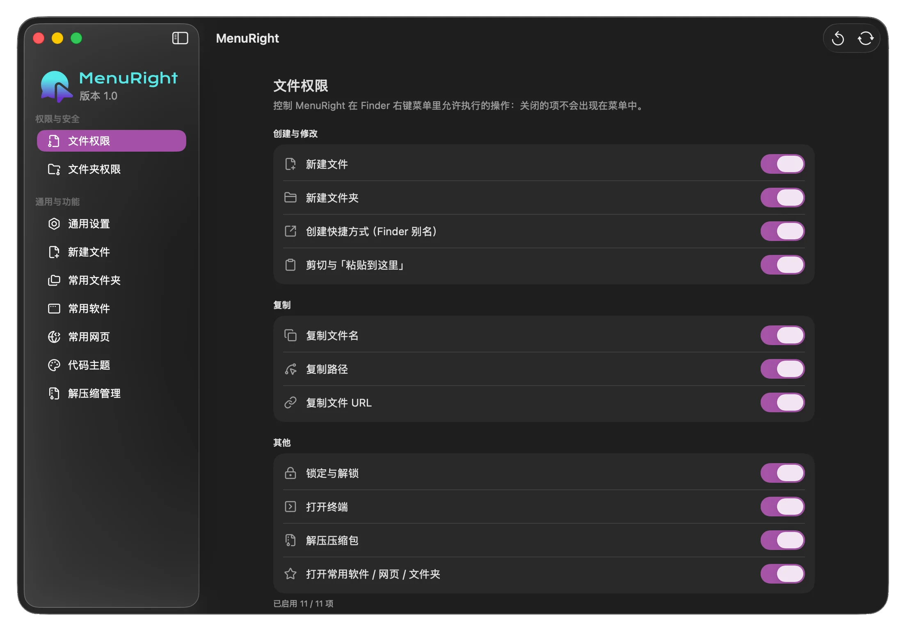

<p align="center">
  
</p>

<h1 align="center">MenuRight</h1>

<p align="center">给 macOS 访达（Finder）右键菜单补上一批「本来应该有」的操作。</p>

MenuRight 由两部分组成：一个 **Finder 扩展**（负责在右键菜单里显示条目）和一个**主应用**
（负责所有真正的文件操作、授权与设置界面）。扩展没有文件写入权限，只发送请求；所有副作用都由主应用
在你已授权的文件夹范围内执行。

<p align="center">
  
</p>

## 功能

### 右键菜单

| 场景 | 菜单项 |
| --- | --- |
| 文件 / 文件夹 | 创建别名、锁定、解锁、复制文件名、复制路径、复制文件 URL、剪切、压缩 ▸ |
| 压缩包 | 上面全部，外加 解压 ▸ |
| 文件夹空白处 | 打开终端、复制文件夹名、复制文件夹路径、新建文件 ▸、新建文件夹、粘贴到这里、常用文件夹 / 软件 / 网页 ▸ |

<p align="center">
  
  &nbsp;&nbsp;&nbsp;
  
</p>

- **压缩 ▸**：ZIP / 7Z / TAR / TAR.GZ / TAR.BZ2，或「自定义压缩…」。列出的格式由设置里的「允许的压缩格式」决定，
  全部取消勾选时仍保留「自定义压缩…」。
- **解压 ▸**：「解压到当前文件夹」始终解压到压缩包所在文件夹；「解压到指定位置…」按设置询问目录或直接解压。
  加密的 zip / 7z 会先查密码本，没命中再弹密码框，密码不对不写任何文件。
- **自定义压缩**：保存为、标签、位置、格式、压缩模式（快速 / 标准 / 极限）。
  支持**加密**（ZIP 传统加密 ZipCrypto、7Z AES-256，7z 可同时加密文件名）、
  **分卷**（`name.zip.001` / `.002` …，7-Zip、Keka、WinRAR 可直接打开）、**固实 7z**。
  「取消」会真正中止压缩，不留下半个文件。
- **密码本**：密码存在系统钥匙串里（不写进设置），压缩时可直接选、解压时优先命中，支持批量导入导出。
- **新建文件 ▸**：Word / Excel / PowerPoint（自研 OOXML 生成）与 Pages / Numbers / Keynote（基于空白模板）。
- **常用文件夹 / 软件 / 网页 ▸**：在设置里配置，右键直达，文件夹用自身图标、软件用 App 图标、网页用站点 favicon。

### 代码预览（空格预览）

- `.swift`、`.py`、`.js`、`.html`、`.css`、`.json`、`.yml`、`.md`、`.sh`、`.c`、`.cpp`、`.java` 等由自带高亮器上色，
  Markdown 直接渲染；其余类型回退系统预览。
- 配色与字体跟随设置里的「代码主题」（9 套，含跟随系统）。

<p align="center">
  
  &nbsp;&nbsp;&nbsp;
  
</p>

### 设置与菜单栏

- **设置**：文件夹授权、文件权限开关、新建文件类型与模板目录、常用收藏、代码主题、
  解压缩管理（格式 / 解压位置 / 同名文件策略 / 体积上限）、语言、登录时自动启动、终端应用、更新检查。
- **菜单栏图标**：打开设置 / 检查更新 / 退出 MenuRight。关闭设置窗口不会退出主应用——
  主应用不在时右键菜单每一项都不可用，所以菜单栏图标是常驻的，只有它上面的「退出」才真正结束服务。

<p align="center">
  
  &nbsp;&nbsp;&nbsp;
  
</p>

## 文件树

```
MenuRight/
├─ MenuRight/                主应用
│  ├─ App/                   界面、设置面板、状态栏、更新检查
│  ├─ IPC/                   与扩展的套接字通信（服务端）
│  └─ Resources/             图标资源、内置模板、第三方许可、README 截图
├─ MenuRightFinder/          Finder 扩展（右键菜单）
│  └─ IPC/                   通信客户端
├─ MenuRightCodePreview/     Quick Look 扩展（代码 / Markdown 预览）
├─ Shared/                   主应用与扩展共用
│  ├─ Archive/               压缩、解压、密码处理
│  ├─ Authorization/         文件夹授权与书签
│  ├─ FileOperations/        文件操作实现
│  ├─ IPC/                   通信协议与传输
│  ├─ Settings/              设置模型与本地化
│  └─ CodePreview/           语法高亮与 Markdown 渲染
├─ MenuRightTests/           单元测试（xcodebuild test）
├─ Config/Version.xcconfig   版本号唯一来源
├─ Scripts/                  版本、发布、验证脚本
├─ MenuRight.xcodeproj       Xcode 工程
├─ LICENSE                   MIT 许可证
├─ README.md
├─ MenuRight 功能规划v2.md    需求与设计记录
└─ MenuRight 验证手册.md      人工验证清单
```

## 怎么使用

1. 下载对应架构的安装包（Apple Silicon 或 Intel，DMG / ZIP 任选），把 **MenuRight.app** 拖进「应用程序」。
2. 首次打开若提示无法验证开发者，在「访达」里右键应用 → **打开**（本项目未做公证，属预期行为）。
3. 首次使用引导里点「打开系统设置…」，在「隐私与安全性 → 扩展」中启用 **MenuRight 扩展**。
4. 打开「文件夹权限」，授权希望 MenuRight 操作的文件夹。**未授权的路径无法写入**，这是沙箱限制。
5. 回到访达，在文件或文件夹上点右键即可看到菜单。

- 需要 **macOS 14.0** 或更高版本；必须启用 Finder 扩展，否则不会出现菜单。
- 想关掉空格预览：系统设置 → 通用 → 登录项与扩展 → 快速查看（macOS 15+）。

从源码构建：

```bash
xcodebuild -project MenuRight.xcodeproj -scheme MenuRight -configuration Release build
xcodebuild -project MenuRight.xcodeproj -scheme MenuRight test
```

要求 Xcode 26 及以上、Swift 6.2 工具链。

## 开源使用情况（第三方依赖）

| 依赖 | 许可 | 用途 |
| --- | --- | --- |
| [SWCompression](https://github.com/tsolomko/SWCompression) | MIT | ZIP / TAR / GZ / BZ2 / XZ 的读写 |
| [BitByteData](https://github.com/tsolomko/BitByteData) | MIT | SWCompression 的依赖 |
| [PLzmaSDK](https://github.com/olehkulykov/PLzmaSDK) | MIT | 7z 的创建与解压 |
| [Lucide](https://lucide.dev) | ISC | 侧边栏与设置图标 |
| [Phosphor](https://phosphoricons.com) | MIT | 侧边栏与设置图标 |

- 只有主应用与测试 target 链接第三方库，Finder 扩展与 Quick Look 扩展不链接任何第三方库。
- 完整许可全文随应用打包，可在「设置 → 通用 → 关于 → 开源许可」中查看，
  仓库内副本在 `MenuRight/Resources/Third-Party-Notices/`。

## 项目开源情况

- 源码公开在 GitHub：<https://github.com/Suxinljh/MenuRight>，版本发布走该仓库的 Releases。
- 采用 **MIT 许可证**，全文见仓库根目录的 [LICENSE](LICENSE)：可自由使用、修改、分发，需保留版权声明。
- 应用检测更新读的是该仓库的 `releases/latest`，只做「检查 → 提示 → 打开下载页」，不会自动下载或替换。
